<p align="center">
  
</p>

<h1 align="center">Fork</h1>

<p align="center"><strong>Don’t ask what to choose. Explore what each choice changes.</strong></p>

<p align="center">
  An AI decision explorer for iOS, Android and web, built with Expo, Claude and RevenueCat.<br/>
  Submitted to <strong>RevenueCat Shipaton 2026</strong>. Submitted for the <strong>Next Gen</strong> award.
</p>

<p align="center">
  <a href="docs/demo/fork-demo.mp4">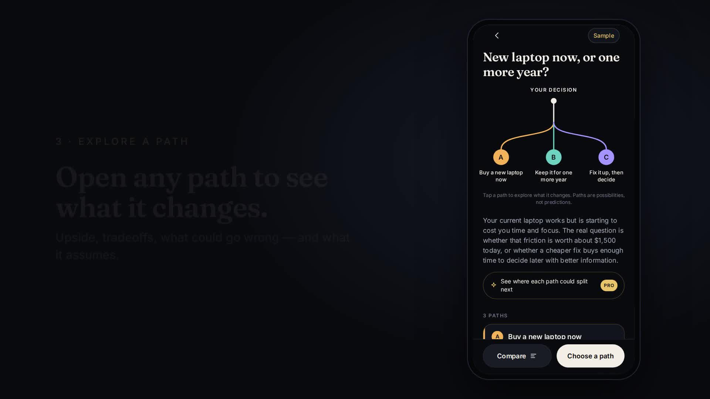</a><br/>
  <sub>▶ <a href="docs/demo/fork-demo.mp4">Watch the demo (54s)</a></sub>
</p>

---

## What is Fork?

Fork turns a difficult decision into **a set of paths you can explore**. Describe what you’re deciding in a sentence or two. Fork maps it into 2–4 materially different paths, shows what each one changes, the tradeoffs and what it assumes, and lets you compare them. Then **you** choose.

Fork never tells you what to do, never ranks the options and never claims to predict the future.

## The problem

Hard decisions stall for three reasons:

1. **The options stay fuzzy.** “Buy now or wait?” hides a third option (fix what you have) and a dozen assumptions.
2. **The tradeoffs are invisible.** You weigh cost against peace of mind in your head, and one worry drowns out everything else.
3. **Asking an AI chatbot gets you a verdict and a wall of text.** Chatbots are built to answer, so they pick for you, sound more certain than they should, and leave you with a paragraph instead of a map.

## The solution

Fork’s core mechanic is **interactive decision scenarios**:

| | |
|---|---|
| **A fork, not an answer** | Your decision is drawn as a branching tree. Each branch is a path you can tap into. |
| **Paths are structured, not prose** | Each path has what changes immediately, upside, tradeoffs, risks, assumptions, uncertainty and what would change it, all as short cards. |
| **Compare on what matters to you** | Choose the dimensions you care about (cost, time, flexibility, risk…). Rows where the paths differ most rise to the top. There are no scores and no winner. |
| **You decide, and remember why** | Pick the path you lean toward (or “still deciding”), write a note to your future self and keep it in your decision journal. |

### Why it isn’t “just ChatGPT”

- **Schema, not chat.** The model fills a strict schema that is validated before anything renders. The UI is a product, not a transcript.
- **Built-in epistemic honesty.** It uses qualitative levels instead of fake percentages, puts assumptions and uncertainty on every path, flags missing information, and adds a professional-advice caution for medical, legal and financial decisions.
- **Agency by design.** The AI is explicitly instructed never to recommend or rank. The only “choose” button belongs to the user.

## How it works

```
Describe → Fork builds 2–4 paths → Explore each path → Compare → Choose & note → Journal
```

| Onboarding | Home | Analysing | Fork | Branch selected |
|---|---|---|---|---|
| 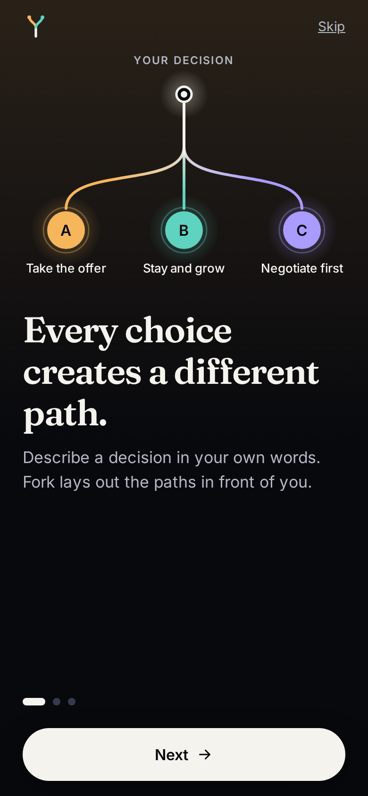 | 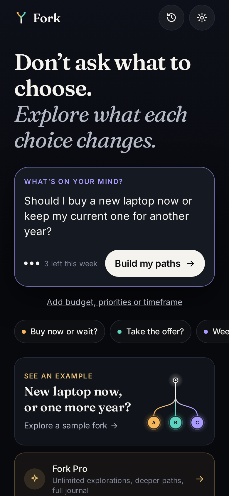 | 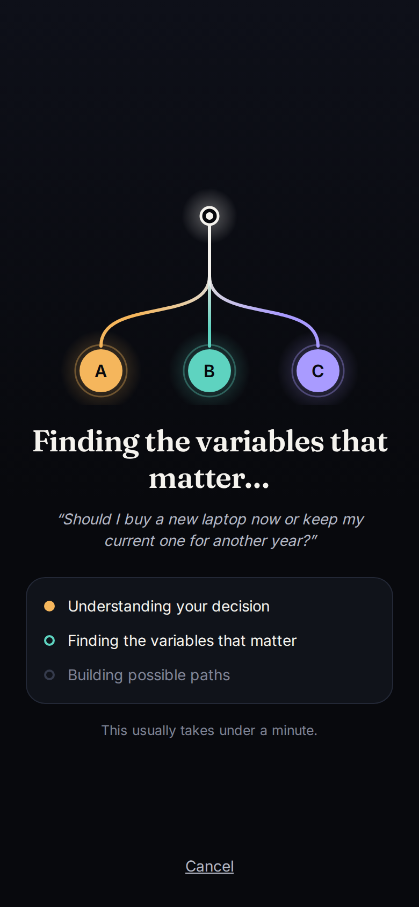 | 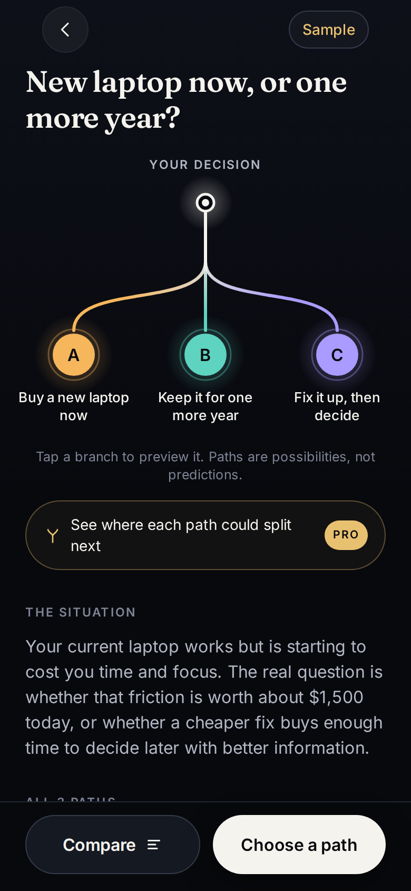 | 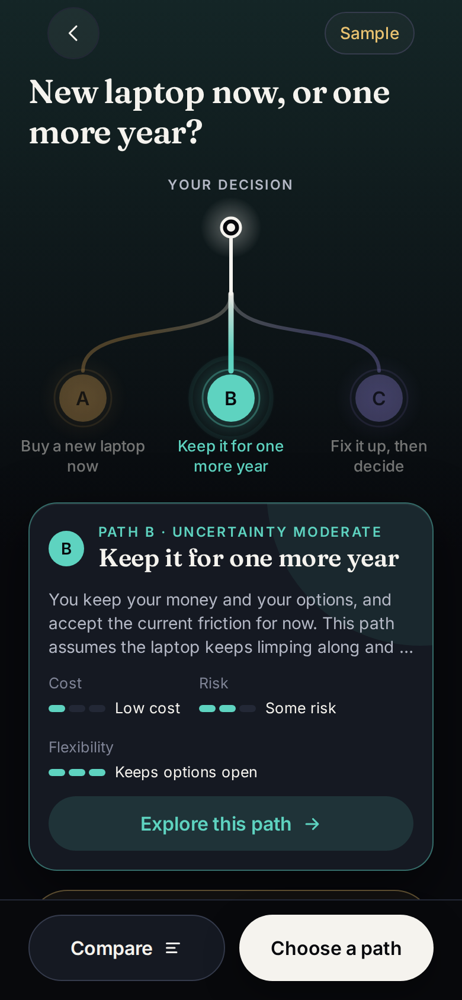 |

| Path | Weigh it up | Compare | Choose | Journal |
|---|---|---|---|---|
| 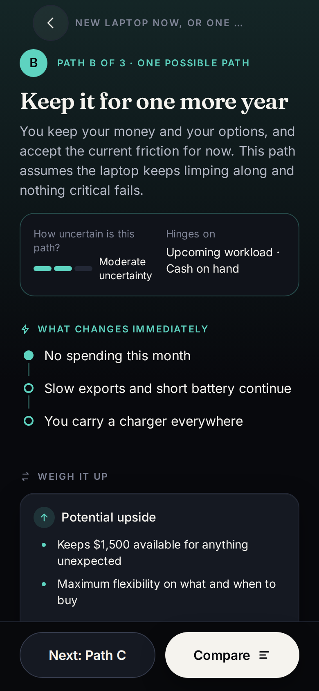 | 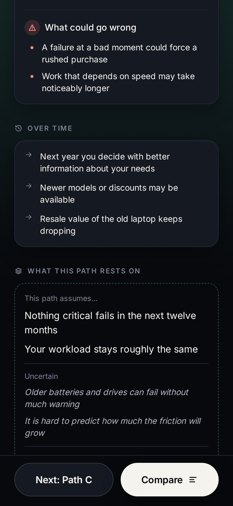 | 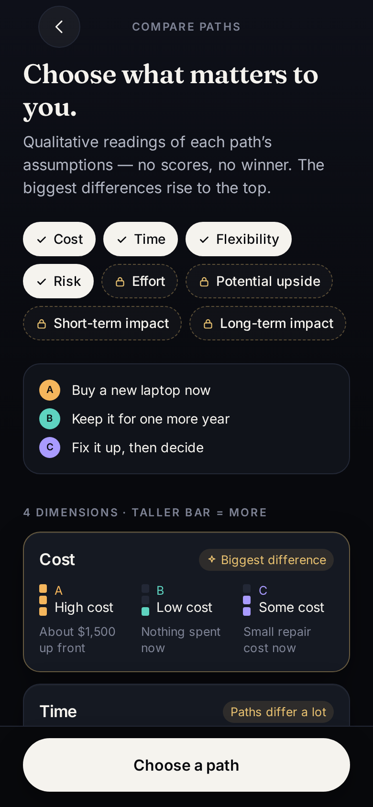 | 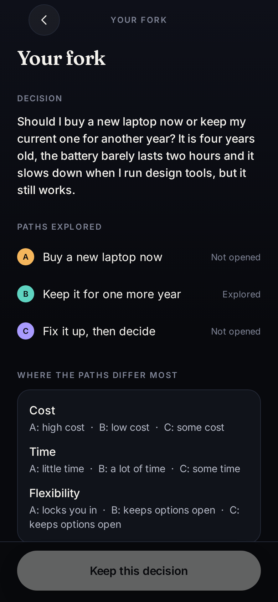 |  |

<sub>Web build at iPhone 14 size, showing the clearly labelled sample decision. The Fork Pro paywall (real price from RevenueCat) is shown in the demo video.</sub>

## Key features

- **Animated fork visualization.** The decision draws itself as SVG branches (A–D). Tap a node to open that path.
- **Structured path detail.** A timeline of immediate effects, plus upside, tradeoffs, risks, “this path assumes”, uncertainty, what would change it, and questions to consider.
- **Comparison.** A qualitative 3-level meter with plain-language labels (never colour alone), user-selectable dimensions, and the biggest differences first.
- **Decision journal.** Local, private history showing the chosen path, your note and the date. You can reopen a decision, update it, explore it again or delete it.
- **Sample decision.** A clearly labelled example (“New laptop now, or one more year?”) you can explore offline without using your allowance.
- **Careful states.** Onboarding, analysing, offline, timeout, rate-limited, refusal, malformed-output retry, empty history, free limit reached, purchase cancelled/pending/failed and restore.
- **Accessibility.** Screen-reader labels and roles, 44pt+ touch targets, reduced-motion support (the tree renders instantly), dynamic type up to 1.6×, and meaning never carried by colour alone.

## Fork Pro and RevenueCat

**RevenueCat powers Fork Pro’s subscription entitlement and purchase flow. That lets the app gate deeper decision exploration and saved decision history behind a legitimate premium product.**

| | Free | Fork Pro (`fork_pro`) |
|---|---|---|
| Explorations | 3 per rolling week | Unlimited |
| Paths per decision | 2–3 | 3–4 |
| Where each path could split next (sub-branches) | Locked preview | ✓ |
| Comparison dimensions | Cost, time, flexibility, risk | + effort, upside, short- and long-term impact |
| Decision journal | Up to 5 decisions | Unlimited |

The monetization is part of the product architecture:

- **One entitlement, `fork_pro`,** attached to a monthly subscription package in the RevenueCat **current offering**.
- **`src/services/revenuecat/purchases.ts`** is the only file that touches `react-native-purchases`. It handles configure, offerings, purchase, restore, the entitlement check, the customer-info listener, and cancellation/pending/failure mapping.
- **`SubscriptionProvider`** exposes `isPro`, the monthly package, `purchase()`, `restore()` and the billing mode to the whole app. It refreshes when the app returns to the foreground and caches the last known entitlement, so Pro users aren’t locked out offline.
- **Natural upgrade moments:** hitting the weekly limit, a full journal, tapping a locked comparison dimension, or tapping “See where each path could split next”. The paywall has a visible close button, “Not now” and “Restore purchases”, and makes no fake-savings claims.
- **Test vs production is explicit.** A `test_` key runs RevenueCat’s **Test Store** (web, Expo Go and dev builds). `appl_` and `goog_` keys run the real stores. With no key, the app runs in a clearly labelled development state and never fakes a purchase.

## AI architecture

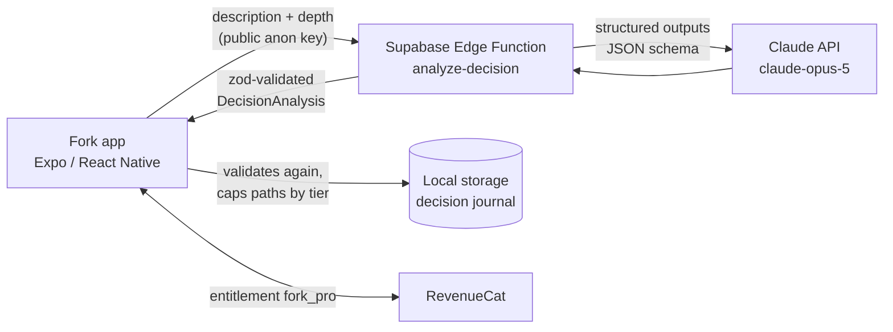

- **Why a proxy:** the model API key never ships in the app. The edge function (`supabase/functions/analyze-decision`) validates input, rate-limits, calls Claude and re-validates the result.
- **Structured outputs:** the request uses `output_config.format` with a JSON schema that mirrors the app’s zod schema. A test fails if the two drift apart.
- **Defence in depth:** the server and client both run the same `parseAnalysis()`. It recovers JSON wrapped in prose or code fences, repairs harmless deviations (duplicate ids, extra list items, wrong-case enums), and otherwise rejects. The client retries once on malformed or transient failures, then shows a friendly error. Raw errors never reach the UI.
- **Prompting:** the system prompt tells the model it explores and never decides. It must state assumptions, avoid invented statistics, describe outcomes as possibilities, build materially different paths with balanced tradeoffs, name missing information and add a caution for high-stakes domains.
- **Model:** `claude-opus-5` with adaptive thinking at `medium` effort, with server-side refusal fallbacks enabled. You can override it with `FORK_MODEL`.

## Product architecture

```
src/
  app/                 Expo Router screens (onboarding, home, new, analyzing,
                       decision/[id]{index,path/[sid],compare,summary}, history, paywall, settings)
  components/          Design system: Text, Button, Card, Chip, PathBadge, LevelMeter,
                       ForkTree (signature SVG visualization), ForkMark, Icon, ConfirmSheet…
  domain/              Pure logic: zod schema, parser/recovery, limits, comparison, sample decision
  services/ai/         AI client (timeout, retry, cancellation, typed errors)
  services/revenuecat/ RevenueCat wrapper + SubscriptionProvider
  store/               zustand store persisted to AsyncStorage (+ in-memory pending request)
  hooks/ theme/ features/
supabase/functions/analyze-decision/   Edge function (Deno)
scripts/               edge schema sync, static web server, demo recorder
```

State is kept light: one small zustand store persisted to AsyncStorage for onboarding, decisions, usage timestamps and the cached Pro flag, plus React context for the subscription.

## Tech stack

Expo SDK 57 · React Native 0.86 · React 19 · TypeScript 6 · Expo Router · react-native-svg · zustand · zod · RevenueCat `react-native-purchases` 10 · Supabase Edge Functions (Deno) · Claude API (`@anthropic-ai/sdk`) · Jest (jest-expo) · ESLint (eslint-config-expo) · EAS Build

## Getting started

Requirements: Node 20+ and npm. For a phone, install **Expo Go** or make a development build.

```bash
git clone https://github.com/Nailer/fork.git
cd fork
npm install
# No .env needed: the public AI endpoint and RevenueCat Test Store key are built in.
# To use your own backend or RevenueCat project: cp .env.example .env
npm run web              # or: npm start (then scan the QR code with Expo Go)
```

- **Web and Expo Go:** RevenueCat runs in its browser/preview mode, so use the **Test Store** key (`test_…`).
- **Native store purchases** need a development build: `npx eas-cli@latest build --profile development --platform ios|android`.

### Environment variables

| Variable | Where | Purpose |
|---|---|---|
| `EXPO_PUBLIC_FORK_API_URL` | app | URL of the `analyze-decision` edge function |
| `EXPO_PUBLIC_FORK_API_KEY` | app | Supabase **anon** key (public; the function verifies JWTs) |
| `EXPO_PUBLIC_REVENUECAT_TEST_KEY` | app | RevenueCat Test Store key (`test_…`) for web, Expo Go and dev builds |
| `EXPO_PUBLIC_REVENUECAT_IOS_KEY` / `_ANDROID_KEY` | app | Store keys (`appl_…` / `goog_…`) for production builds |
| `EXPO_PUBLIC_REVENUECAT_ENTITLEMENT` | app | Entitlement id, default `fork_pro` |
| `ANTHROPIC_API_KEY` | **edge function secret** | Claude API key. Never put this in the app. |
| `FORK_MODEL`, `FORK_RATE_LIMIT_PER_10_MIN` | edge function (optional) | Model override (default `claude-opus-5`) and rate limit (default 12) |

Everything prefixed `EXPO_PUBLIC_` is bundled into the app and must be public.

### RevenueCat setup (about 5 minutes)

1. Create a RevenueCat project, then open **Apps & providers** and add the **Test Store**.
2. Create a product `fork_pro_monthly` (monthly subscription) in the Test Store.
3. Create an entitlement **`fork_pro`** and attach the product.
4. Create an offering, mark it **Current**, and add a **Monthly** package containing `fork_pro_monthly`.
5. Copy the Test Store public API key (`test_…`) into `EXPO_PUBLIC_REVENUECAT_TEST_KEY`.

For the App Store or Google Play, add those apps in RevenueCat, attach the store products to the same entitlement and offering, and set the `appl_` / `goog_` keys.

### Deploy the AI proxy

```bash
npx supabase functions deploy analyze-decision --project-ref <ref>
npx supabase secrets set ANTHROPIC_API_KEY=sk-ant-... --project-ref <ref>
```

After you change anything in `src/domain/schema.ts` or `parse.ts`, run `npm run sync:edge` so the function validates with the same rules.

## Testing

```bash
npm test            # 52 Jest tests
npm run typecheck   # tsc --noEmit
npm run lint        # expo lint
```

The tests cover schema validation, recovery from malformed AI output, usage limits, comparison logic, the AI client (success, retry, timeout, offline, cancellation and every HTTP error mapping), store persistence and deletion, the Pro entitlement check, purchase-error mapping, billing-mode detection, and that the edge function’s schema and prompt stay in sync with the app.

## Demo

- **Video:** [`docs/demo/fork-demo.mp4`](docs/demo/fork-demo.mp4), recorded from the real app with `scripts/record-demo.mjs`. Set `LIVE=1` to type a decision and generate it live.
- **Try it:** `npm run web`, then tap **See an example** on the home screen to walk the full flow offline.
- **Script:** [`docs/DEMO_SCRIPT.md`](docs/DEMO_SCRIPT.md)

## Privacy and security

- Decisions and notes are stored **only on the device**. Settings → *Delete all my data* wipes everything.
- A new exploration sends your description to the edge function and on to Claude to generate paths. Fork does not store it server-side, and the function logs no decision text.
- No analytics SDKs. Product events carry no personal data and only print in development.
- No secrets in the repo: the model key lives in edge-function secrets, and only public keys (Supabase anon, RevenueCat public SDK keys) are used in the app.

## Future improvements

- Server-side entitlement check (RevenueCat REST API) before running deep explorations
- iCloud or Google account sync for the journal, and reminders to revisit a decision
- Annual plan and introductory offer in the RevenueCat offering
- Localisation

## Hackathon submission

- **Event:** RevenueCat Shipaton 2026
- **Award:** Next Gen (student): public open-source repo + demo video
- **Repository:** https://github.com/Nailer/fork (MIT)
- **Submission copy:** [`DEVPOST.md`](DEVPOST.md) · **Release steps:** [`FINAL_RELEASE.md`](FINAL_RELEASE.md)

## License

[MIT](LICENSE) © 2026 Nailer
