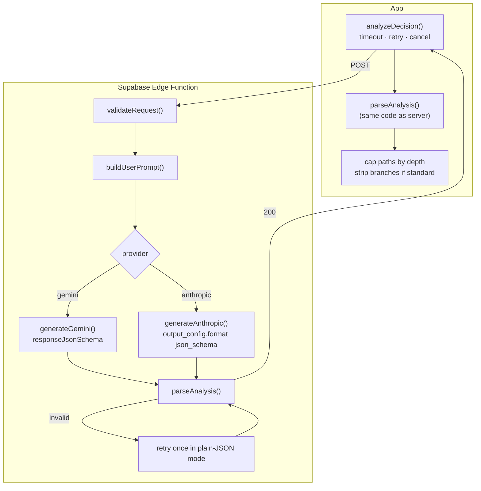

Fork’s AI layer has one job: turn a few sentences into a **`DecisionAnalysis`** object that the UI can render with no surprises.

## Guarantees

<CardGroup cols={2}>
  <Card title="Keys stay on the server" icon="key-round">
    The app only has the Supabase **anon** key. `GEMINI_API_KEY` / `ANTHROPIC_API_KEY` are edge-function secrets.
  </Card>
  <Card title="Structured output" icon="braces">
    Both providers get a JSON schema (`OUTPUT_SCHEMA`) that mirrors the app’s zod schema.
  </Card>
  <Card title="Validated twice" icon="shield-check">
    The server and the client both run `parseAnalysis()`. The UI never renders unvalidated data.
  </Card>
  <Card title="Forgiving, not lax" icon="wrench">
    Harmless deviations (extra items, wrong-case enums, duplicate ids) are repaired. Structural problems are rejected.
  </Card>
  <Card title="Bounded time" icon="timer">
    105 s server budget, 125 s client timeout, and timeouts are never retried.
  </Card>
  <Card title="Friendly failures" icon="message-square-warning">
    Ten typed error kinds, each with its own copy and next action. Raw errors never reach the UI.
  </Card>
</CardGroup>

## Pages in this section

| Page | Covers |
|---|---|
| [Edge function](/ai/edge-function) | The `analyze-decision` handler, step by step |
| [Providers](/ai/providers) | Gemini vs Claude, selection rules, models, effort, fallback |
| [Prompting](/ai/prompting) | The system prompt, the user prompt and depth instructions |
| [Schema](/ai/schema) | The zod schema, the JSON schema and how they’re kept in sync |
| [Parsing and recovery](/ai/parsing-and-recovery) | `extractJson`, `normalizeAnalysis`, `parseAnalysis` |
| [AI client](/ai/client) | `analyzeDecision()` in the app: headers, timeout, retry, cancellation |
| [Error handling](/ai/errors) | Every HTTP status and error code → user-facing kind |

## Current production status

<Warning>
As of **30 September 2026**, the deployed `analyze-decision` function (version 12) is an **older Claude-only build**, and it returns `503 not_configured` because no model key is set. The Gemini-first code in the repository (commit `a370f53`) hasn’t been deployed yet. See [Deploy the AI proxy](/deploy/supabase-edge-function) for the fix.
</Warning>
