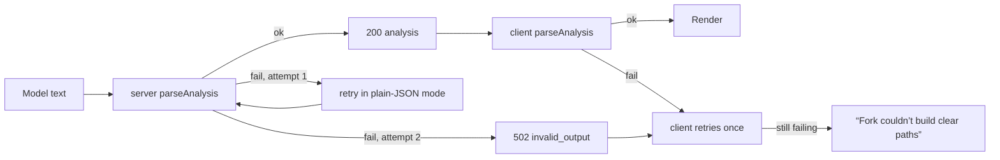

`src/domain/parse.ts` is the defence layer between the model and the UI. The **same file** runs on the server (as a generated copy) and on the device.

```ts
export type ParseResult =
  | { ok: true; analysis: DecisionAnalysis }
  | { ok: false; reason: 'not_json' | 'invalid_shape'; detail?: string };

export function parseAnalysis(raw: unknown): ParseResult;
```

It takes three stages: **extract → normalise → validate**.

## 1. Extract JSON: `extractJson(raw)`

If `raw` is a string, Fork looks for a JSON object:

1. Try `JSON.parse` on the trimmed string.
2. Otherwise, if there’s a fenced block (```` ```json … ``` ```` or ```` ``` … ``` ````), use its contents.
3. Take the substring from the first `{` to the last `}` and try `JSON.parse` again.
4. If nothing parses → `{ ok: false, reason: 'not_json' }`.

So all of these recover:

````text
{"decisionTitle": "…", …}
Here is your analysis:
```json
{"decisionTitle": "…", …}
```
Sure! {"decisionTitle": "…", …} Let me know if…
````

Truncated JSON (e.g. cut off by `max_tokens`) does **not** recover. It’s `not_json`.

## 2. Normalise: `normalizeAnalysis(value)`

A forgiving pre-pass that repairs **harmless** deviations so a mostly-correct response still renders:

| Deviation | Repair |
|---|---|
| More than 4 scenarios | Keep the first 4 |
| Missing, blank or duplicate scenario `id` | Replace with `path-<n>` |
| Scenario lists too long (e.g. 7 benefits) | Slice to the limit (5, or 4 for `uncertainty`, `whatWouldChange`, `questionsToConsider`) |
| Empty or non-string list items | Removed |
| `uncertaintyLevel: "High"` | Lower-cased |
| Rating `level: "MODERATE"` | Lower-cased |
| Ratings with an unknown or duplicate dimension | Dropped |
| `branches: null` or `[]` | Key removed |
| More than 2 branches | Keep the first 2 |
| `comparisonDimensions` with unknown or duplicate values | Filtered and de-duplicated |
| `questions`, `assumptions` too long | Sliced to 5 |
| `missingInformation` missing | `[]`, then sliced to 4 |
| More than 6 `variables` | Keep the first 6 |
| `caution` missing | `null` |

Anything **structurally** wrong (a missing required field, wrong types, fewer than 2 scenarios, a string that’s too long) is left alone for the schema to reject.

## 3. Validate: `DecisionAnalysisSchema.safeParse()`

On failure, `parseAnalysis` returns the first zod issue as `detail`, for example `scenarios.1.title: Too big: expected string to have <=90 characters`. The server logs that detail. The client passes it into `AnalysisError('invalid_output', detail)`, which is never shown to the user.

## Where it runs and what happens on failure



In the worst case one tap can cause up to **four** model calls (2 server attempts × 2 client attempts), still bounded by the time budgets.

## Tests

`parse.test.ts` covers: the sample validates; fewer than 2 scenarios is rejected; unknown uncertainty levels are rejected; prose returns `not_json`; truncated JSON returns `not_json`; JSON inside a fence and prose is recovered; odd inputs (`null`, numbers, arrays, `undefined`) never throw; harmless deviations are repaired; `extractJson` finds an object inside surrounding text.
