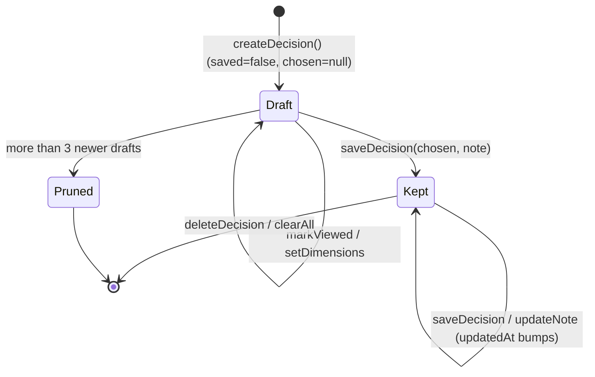

Defined in `src/domain/types.ts` and persisted in the `decisions` array of the store (`fork:v1`).

```ts
export type DecisionInput = {
  description: string;
  priorities?: string;
  budget?: string;
  timeHorizon?: string;
};

export type AnalysisDepth = 'standard' | 'deep';

/** 'ai' = generated live, 'sample' = the bundled example (clearly labelled in the UI). */
export type DecisionSource = 'ai' | 'sample';

export type ChosenPath = { kind: 'scenario'; scenarioId: string } | { kind: 'undecided' };

export type Decision = {
  id: string;                         // `${Date.now().toString(36)}-${random6}`
  createdAt: number;                  // ms
  updatedAt: number;                  // ms, bumped on save or note update
  input: DecisionInput;
  analysis: DecisionAnalysis;
  source: DecisionSource;
  depth: AnalysisDepth;
  selectedDimensions: DimensionKey[]; // the comparison selection
  viewedScenarioIds: string[];        // paths opened (for “Explored”)
  chosen: ChosenPath | null;          // null until kept
  note: string;                       // ≤ 600 chars from the UI, trimmed
  saved: boolean;                     // false = draft
};

export const PATH_LETTERS = ['A', 'B', 'C', 'D'] as const;
```

## Lifecycle



## Persisted store envelope

```json
{
  "state": {
    "onboarded": true,
    "decisions": [ { "id": "mg3k2x1-a1b2c3", "saved": true, "...": "..." } ],
    "explorations": [1790700000000, 1790786400000],
    "proCache": false
  },
  "version": 1
}
```

That’s zustand’s `persist` format, stored under the key `fork:v1`.
