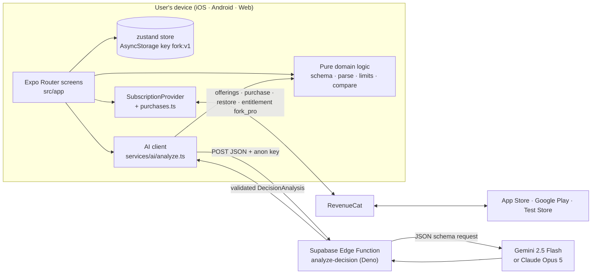

Fork is a **client-heavy** app. Almost all product logic runs on the device. The only server component is a single stateless edge function that keeps model keys secret.



## The parts

<CardGroup cols={2}>
  <Card title="Expo app" icon="smartphone" href="/architecture/project-structure">
    Expo SDK 57, React Native 0.86, React 19, TypeScript 6 and Expo Router. One codebase for iOS, Android and web.
  </Card>
  <Card title="AI proxy" icon="server" href="/ai/edge-function">
    `supabase/functions/analyze-decision`: validates input, rate-limits, calls the model and re-validates the output.
  </Card>
  <Card title="Model provider" icon="brain" href="/ai/providers">
    Google Gemini (`gemini-2.5-flash`) when `GEMINI_API_KEY` is set, otherwise Anthropic Claude (`claude-opus-5`).
  </Card>
  <Card title="RevenueCat" icon="credit-card" href="/revenuecat/overview">
    Offerings, purchase, restore and the `fork_pro` entitlement. The Test Store in development, real stores in production.
  </Card>
</CardGroup>

## Design decisions

| Decision | Why |
|---|---|
| **A proxy instead of calling the model from the app** | The model key must never ship in a bundle. The proxy also centralises validation, rate limiting and the time budget. |
| **Structured output with one zod schema, validated twice** | The UI can trust every field, and a malformed response becomes a clear error rather than a broken layout. See [Parsing and recovery](/ai/parsing-and-recovery). |
| **Local-only storage** | There are no accounts, so nothing to breach, and the app works offline for everything except building new paths. |
| **One small zustand store** | The whole persisted state is four fields. A heavier state library would add ceremony without benefit. |
| **Pure domain modules** | `src/domain/*` has no React or native imports, so it’s unit-testable and shareable with the Deno edge function (`npm run sync:edge`). |
| **One RevenueCat wrapper module** | Screens never import `react-native-purchases`. Every call goes through `purchases.ts`, so error mapping stays consistent. |
| **SVG on a rAF clock for animation** | The signature tree animation looks the same on iOS, Android and web. See [The fork tree](/architecture/fork-tree). |
| **Public defaults in `config.ts`** | `git clone && npm install && npm run web` works with no setup. That matters for judges and contributors. |

## Layers inside the app

```text
src/app          Screens (Expo Router)            → depend on everything below
src/features     Flows used by several screens    → explore.ts, openSample.ts
src/components   Design-system components         → ui.tsx, ForkTree, ForkMark, Icon, Text…
src/hooks        useDecisionParam, useProgress, useReducedMotion
src/services     Side effects: AI client, RevenueCat, config, analytics
src/store        zustand: persisted store + in-memory pending request
src/domain       Pure logic & types: schema, parse, limits, compare, dimensions, sample
src/theme        Tokens, a11y helpers, web-only style helpers
```

Dependencies point downward: `domain` imports nothing from the app, and `services` never import screens.

## Runtime startup

<Steps>
  <Step title="Splash held">
    `SplashScreen.preventAutoHideAsync()` keeps the native splash visible.
  </Step>
  <Step title="Fonts + store">
    `RootLayout` loads five font faces (Fraunces 600 and 400 italic, Inter 400/500/600) and waits for the zustand store to rehydrate from AsyncStorage (`hydrated: true`).
  </Step>
  <Step title="Providers mount">
    `SafeAreaProvider` → `SubscriptionProvider`, which configures RevenueCat synchronously and starts fetching customer info and offerings → `Stack` navigator.
  </Step>
  <Step title="Launch route">
    `/` draws the mark, then routes to `/onboarding` or `/home` after 850 ms.
  </Step>
</Steps>

Next: [Request lifecycle](/architecture/request-lifecycle) follows one exploration end to end.
