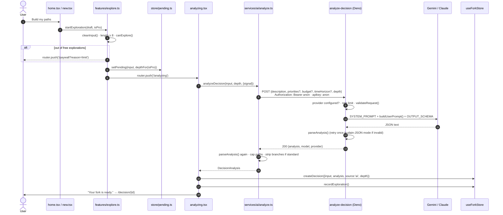

## Sequence



## Step by step

### 1. Input is cleaned and gated

`startExploration()` in `src/features/explore.ts`:

```ts
export const MIN_DESCRIPTION = 8;

export function startExploration(raw: DecisionInput, isPro: boolean) {
  const input = cleanInput(raw);                      // trim, drop empty optionals
  if (input.description.length < MIN_DESCRIPTION) return false;
  if (!canExplore(useForkStore.getState().explorations, isPro)) {
    router.push({ pathname: '/paywall', params: { reason: 'limit' } });
    return false;
  }
  track('decision_started', { withContext: Boolean(input.priorities || input.budget || input.timeHorizon) });
  usePending.getState().setPending(input, depthFor(isPro));
  router.push('/analyzing');
  return true;
}
```

The request is handed over through an **in-memory** zustand store (`usePending`), not route params. That keeps the description out of URLs and browser history.

### 2. The client calls the proxy

`analyzeDecision()` (see [AI client](/ai/client)) posts JSON with the public anon key in both `Authorization` and `apikey` headers, a 125 s timeout, and cancellation through an `AbortSignal`.

### 3. The proxy validates, generates and re-validates

See [Edge function](/ai/edge-function). In short: CORS preflight → provider key check → IP rate limit → body validation → up to two model attempts within a 105 s budget → `parseAnalysis()` → JSON response with a stable error code on failure.

### 4. The client trusts nothing

Even a `200` response goes through `parseAnalysis()` on the device. Then:

```ts
const maxPaths = maxPathsFor(depth);                  // 3 standard, 4 deep
return {
  ...analysis,
  scenarios: analysis.scenarios.slice(0, maxPaths).map((s) =>
    depth === 'deep' ? s : { ...s, branches: undefined },
  ),
};
```

### 5. The result is stored as a draft

`createDecision()` gives the decision an id (`<base36 time>-<6 random chars>`), preselects the free dimensions the model actually rated, and prunes old drafts (keeping all saved decisions plus the 3 newest drafts). `recordExploration()` appends `Date.now()` to the rolling-window timestamps.

### 6. Navigation

After a 0.9 s *“Your fork is ready.”* beat, `router.replace('/decision/{id}')` replaces the analysis screen, so Back doesn’t return to it.

## Failure paths

| Where it fails | Result |
|---|---|
| Out of explorations | Paywall (`limit`). No request is sent. |
| Fetch throws | `cancelled` if you aborted, `timeout` if the 125 s timer fired, otherwise `offline` |
| Non-2xx response | Mapped by status and `error` code. See [Error handling](/ai/errors). |
| 2xx but invalid shape | `invalid_output`, retried once by the client |
| User taps Cancel | Request aborted. Nothing is stored and no exploration is used. |
