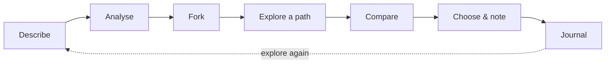
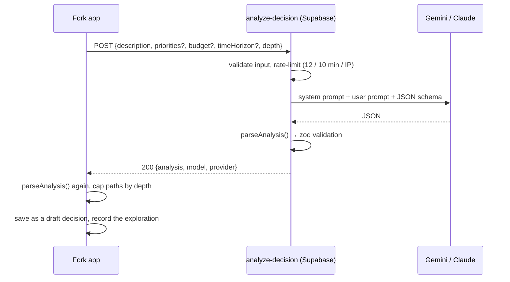

Fork is one loop with seven steps:

## 1. Describe

You type the decision in your own words on **Home** (*What’s on your mind?*) or on the **New decision** screen. A sentence or two is enough, and the minimum is **8 characters**. On the New decision screen you can also add optional context:

| Field | Example | Limit |
|---|---|---|
| **What matters most** | “Peace of mind, not wasting money” | 240 characters |
| **Budget** | “Around $1,500” | 240 characters |
| **Time horizon** | “The next 12 months” | 240 characters |

The description itself is capped at **2,000 characters**. Whatever you type is remembered as a draft if you leave the screen.

Before sending anything, Fork checks three things:

- **Allowance.** Free users get 3 explorations per rolling 7 days. If you’ve used them, Fork opens the paywall instead. See [Free vs Pro](/product/free-vs-pro).
- **Connectivity.** If you’re offline, the button is disabled and a banner explains why.
- **Configuration.** If the build has no AI endpoint, Fork offers the sample decision instead.

→ [Describe a decision](/product/describe-a-decision)

## 2. Analyse

Fork sends your description, context and **depth** (`standard` for Free, `deep` for Pro) to the [`analyze-decision` edge function](/ai/edge-function). While it waits, the fork keeps drawing and redrawing itself, and three honest stage labels advance on a 5-second timer:

1. *Understanding your decision…*
2. *Finding the variables that matter…*
3. *Building possible paths…*

Only **“Your fork is ready.”** is tied to the real result. The stages never claim a step has finished when it hasn’t.

Behind the scenes:

→ [Analysis screen](/product/analysis) · [Request lifecycle](/architecture/request-lifecycle)

## 3. Fork

The decision appears as an animated SVG tree. The root is your decision, and each branch (**A, B, C, D**) is a path with its own colour. Tap a node and that branch thickens and pulses, the others recede, the background tints to the path’s colour, and a preview card slides in with the path’s **cost, risk and flexibility**.

Below the tree:

- **The situation**: a short summary of the decision.
- **All N paths**: a row per path, marked **Explored** once you’ve opened it.
- **Factors that matter**: the variables that drive this decision.
- **What Fork doesn’t know**: information that’s missing and would change the picture.

If the decision is medical, legal, financial or safety-related, a calm **“Worth talking to a professional”** banner appears at the top.

→ [The fork](/product/the-fork)

## 4. Explore a path

Each path opens into short, scannable sections:

| Section | What it shows |
|---|---|
| **Header** | Path letter, title, summary, uncertainty level and what the path *hinges on* |
| **What changes immediately** | A timeline of the first effects |
| **Weigh it up** | Potential upside, tradeoffs, and what could go wrong |
| **Over time** | Longer-term considerations |
| **What this path rests on** | *This path assumes…*, what’s uncertain, and what would change it |
| **Where this path could split** | Two sub-branches per path (Fork Pro, deep explorations) |
| **Questions worth answering** | Questions that would sharpen the decision |

→ [Path detail](/product/path-detail)

## 5. Compare

A side-by-side matrix across the dimensions you choose. Each reading is qualitative (**low / moderate / high**) with a plain-language label and a short note. Rows are sorted by **spread**, meaning how far apart the paths are, so the biggest difference is at the top. Nothing is totalled, scored or declared a winner.

→ [Compare](/product/compare)

## 6. Choose & keep

The **Your fork** screen recaps the decision, the paths you explored, where they differ most, the key tradeoffs and the questions worth answering. You pick the path you’re **leaning toward**, or **Still deciding**, and add an optional note (up to 600 characters) to your future self. Then **Keep this decision**.

→ [Choose and keep](/product/choose-and-keep)

## 7. Journal

Kept decisions go into the on-device **Decision journal**, grouped into *This week* and *Earlier*. Reopen one to see the path you leaned toward and your note. You can **explore it again** (a fresh exploration from the same words), update it, or delete it.

→ [Decision journal](/product/decision-journal)

## Where Fork Pro fits in

Upgrade prompts appear only where Pro adds real value:

| Moment | Paywall reason |
|---|---|
| Weekly limit reached | `limit` |
| Journal full (5 decisions on Free) | `save` |
| Tapping a locked comparison dimension | `compare` |
| Tapping “See where each path could split next” | `depth` |
| Home → Fork Pro card, Settings → See Fork Pro | `upgrade` |

→ [Fork Pro and RevenueCat](/revenuecat/overview)
