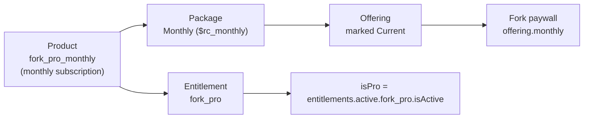
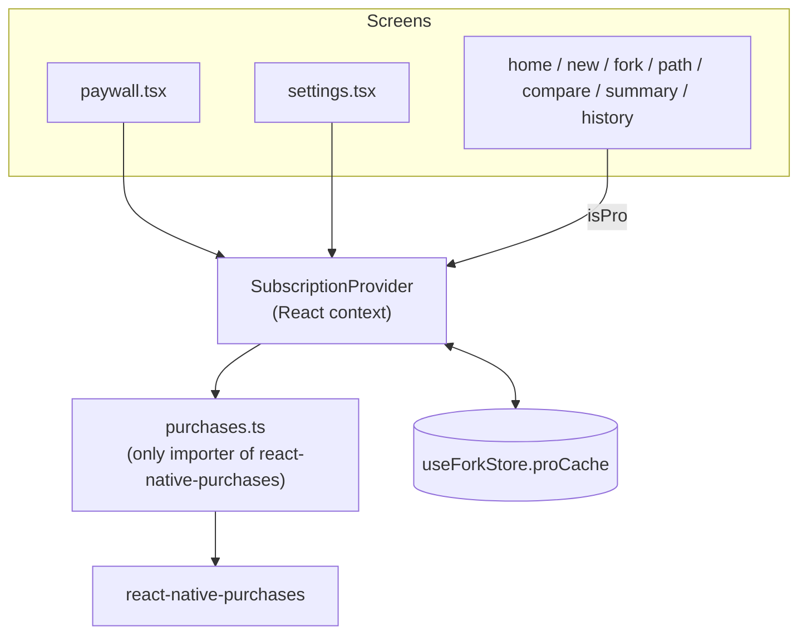

**RevenueCat powers Fork Pro’s subscription entitlement and purchase flow.** That lets Fork gate deeper decision exploration and unlimited history behind a real premium product, with the same code on the App Store, Google Play and RevenueCat’s Test Store.

## The model



| RevenueCat object | Fork value | Used for |
|---|---|---|
| **Entitlement** | `fork_pro` (override with `EXPO_PUBLIC_REVENUECAT_ENTITLEMENT`) | Deciding `isPro` |
| **Product** | `fork_pro_monthly` (monthly subscription) | What the store sells |
| **Offering** | Any identifier, marked **Current** | What the paywall shows |
| **Package** | **Monthly** (falls back to the first available package) | The one plan on the paywall |

## Architecture in the app



- **`purchases.ts`** is the **only** file that imports `react-native-purchases`. It configures the SDK and wraps offerings, purchase, restore, the entitlement check and the customer-info listener, with consistent error mapping. → [Purchases module](/revenuecat/purchases-module)
- **`SubscriptionProvider`** exposes `isPro`, the monthly package, `purchase()`, `restore()`, `refresh()`, the billing mode, and `managementURL` to every screen. It refreshes when the app returns to the foreground and caches the entitlement for offline use. → [SubscriptionProvider](/revenuecat/subscription-provider)
- **`paywall.tsx`** shows the real price, a Free vs Pro table, **Continue with Fork Pro**, **Restore purchases**, **Not now** and a close button. → [Paywall](/revenuecat/paywall)

## Billing modes

The key decides the mode, so no code changes between development and production:

| Key | Mode | Behaviour |
|---|---|---|
| `test_…` | `test` | RevenueCat **Test Store**. Works on web, Expo Go and dev builds. Purchases are simulated. |
| `appl_…` / `goog_…` | `production` | Real App Store / Google Play purchases (native builds only) |
| none | `unconfigured` | Purchases disabled and labelled as such. Never faked. |

Key resolution per platform (`src/services/config.ts`):

```ts
if (Platform.OS === 'ios') return rcIos ?? rcTest;
if (Platform.OS === 'android') return rcAndroid ?? rcTest;
return rcTest;   // web
```

The project ships a default Test Store key, so a fresh clone can complete a simulated purchase with no setup.

## Where Pro shows up

| Surface | Free | Pro |
|---|---|---|
| Home wordmark | — | **PRO** badge |
| Home allowance | ●●○ *2 left this week* | ∞ *Unlimited* |
| Home Fork Pro card | Shown | Hidden |
| Depth of new explorations | `standard` (2–3 paths) | `deep` (3–4 paths + sub-branches) |
| Fork screen | *See where each path could split next · PRO* teaser | Twigs on the tree |
| Path detail | Locked *N possible next splits* | Full sub-branches |
| Compare chips | 4 unlocked, 4 locked | All 8 |
| Journal | *N/5 on Free* | Unlimited |
| Settings | *Fork Free* + **See Fork Pro** | *Fork Pro · ACTIVE* + **Manage subscription** |

## Next

<CardGroup cols={2}>
  <Card title="Set up RevenueCat" icon="list-checks" href="/revenuecat/setup">About 5 minutes in the dashboard.</Card>
  <Card title="Store builds" icon="store" href="/revenuecat/store-builds">App Store and Google Play products on the same entitlement.</Card>
</CardGroup>
